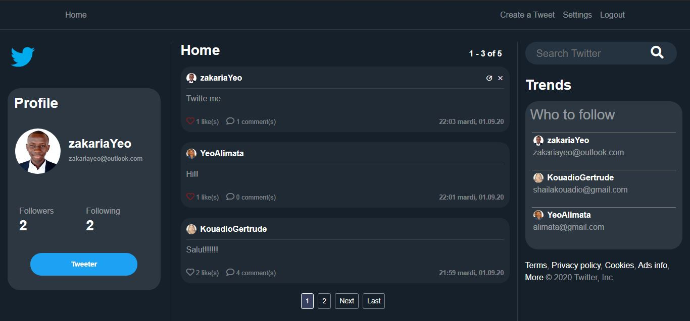

# Django Twitter Clone

Fully functional Django App that looks exactly like real Twitter.

Demo Image:


## Setup

1. Git Clone the project with: ```git clone https://github.com/zakariaYeo/Django-Twitter-Clone.git```.

2. Move to the base directory: ```cd Django-Twitter-Clone```

3. Create a new python environment with: ```python -m venv venv```.

4. Activate environment with: ```venv\Scripts\activate``` on windows, or ```source venv/bin/activate``` on Mac and Linux.

5. Install required dependencies with: ```pip install -r requirements.txt```.

6. Make migrations with: ```python manage.py makemigrations``` and then ```python manage.py migrate```.

7. Run app locally with: ```python manage.py runserver```.


